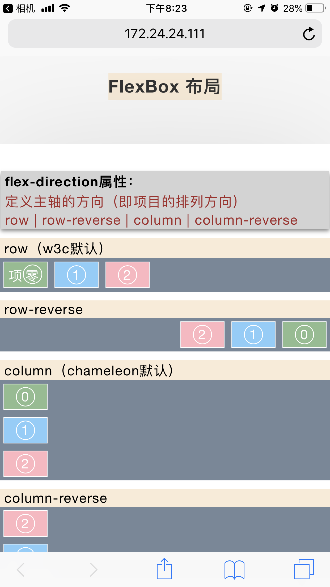
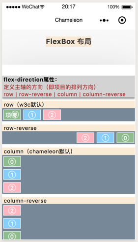
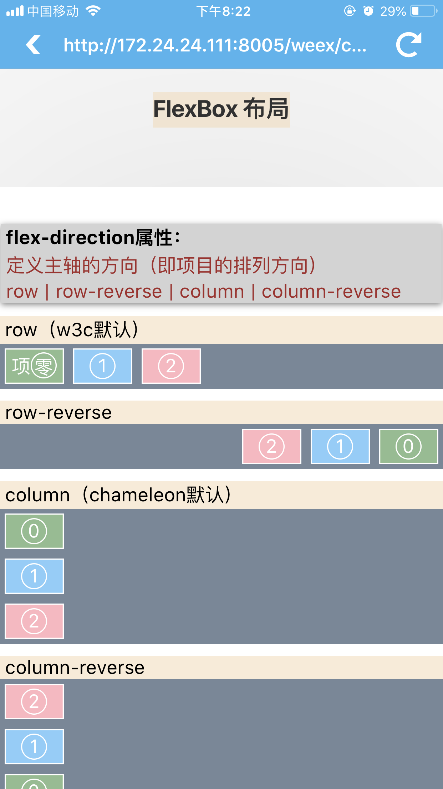
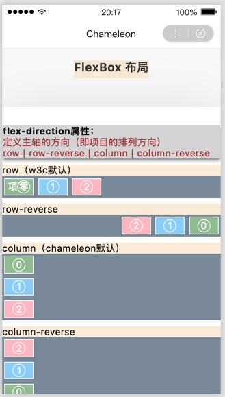
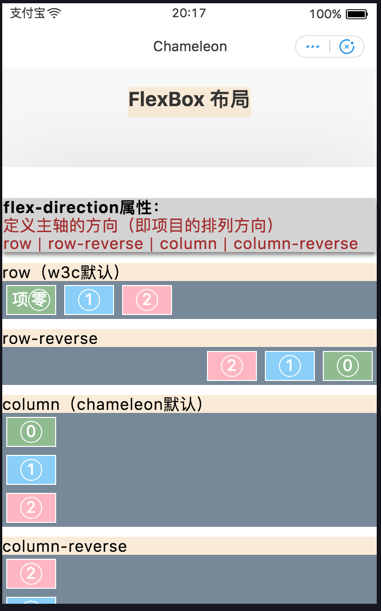

# cml-flexbox
基于[chameleon](https://github.com/didi/chameleon)跨端框架，测试 FlexBox 布局实现效果

web 端访问地址：

# 使用

- 克隆项目 `git clone https://github.com/startheart/cml-flexbox.git`
- 安装项目依赖 `npm install`
- 全局安装cml脚手架 `npm i chameleon-tool -g`
- 启动项目 `cml dev`

### 预览效果

| web   |      微信小程序      |  native-weex |  百度小程序 |  支付宝小程序 |
|:----------:|:-------------:|:------:|:------:|:------:|
|  |  |  | | |